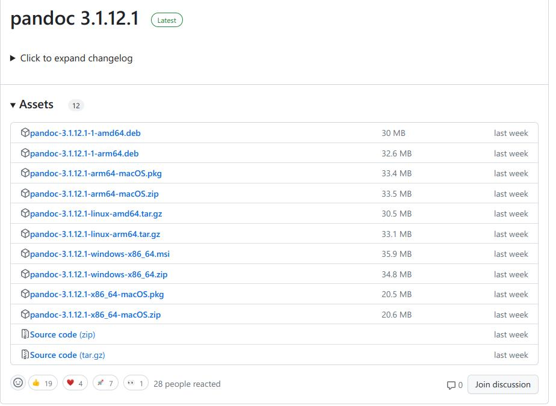
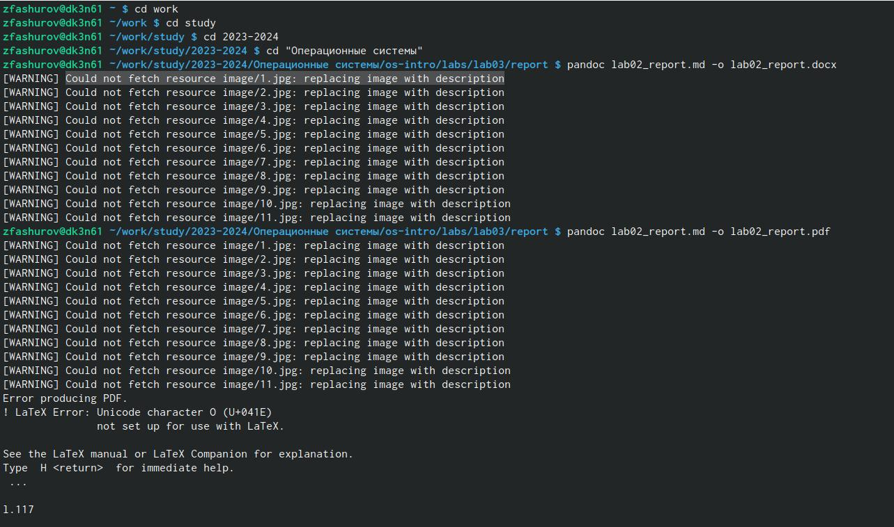

---
## Front matter
title: "Отчёт по лабораторной работе №3"
subtitle: "дисциплина: Операционные системы"
author: "Ашуров Захид Фамил Оглы"

## Generic otions
lang: ru-RU
toc-title: "Содержание"

## Bibliography
bibliography: bib/cite.bib
csl: pandoc/csl/gost-r-7-0-5-2008-numeric.csl

## Pdf output format
toc: true # Table of contents
toc-depth: 2
lof: true # List of figures
lot: true # List of tables
fontsize: 12pt
linestretch: 1.5
papersize: a4
documentclass: scrreprt
## I18n polyglossia
polyglossia-lang:
  name: russian
  options:
	- spelling=modern
	- babelshorthands=true
polyglossia-otherlangs:
  name: english
## I18n babel
babel-lang: russian
babel-otherlangs: english
## Fonts
mainfont: PT Serif
romanfont: PT Serif
sansfont: PT Sans
monofont: PT Mono
mainfontoptions: Ligatures=TeX
romanfontoptions: Ligatures=TeX
sansfontoptions: Ligatures=TeX,Scale=MatchLowercase
monofontoptions: Scale=MatchLowercase,Scale=0.9
## Biblatex
biblatex: true
biblio-style: "gost-numeric"
biblatexoptions:
  - parentracker=true
  - backend=biber
  - hyperref=auto
  - language=auto
  - autolang=other*
  - citestyle=gost-numeric
## Pandoc-crossref LaTeX customization
figureTitle: "Рис."
tableTitle: "Таблица"
listingTitle: "Листинг"
lofTitle: "Список иллюстраций"
lolTitle: "Листинги"
## Misc options
indent: true
header-includes:
  - \usepackage{indentfirst}
  - \usepackage{float} # keep figures where there are in the text
  - \floatplacement{figure}{H} # keep figures where there are in the text
---

# Цель работы

Научиться оформлять отчёты с помощью легковесного языка разметки Markdown.

# Задание

1. Сделайте отчёт по предыдущей лабораторной работе в формате Markdown.
2. В качестве отчёта просьба предоставить отчёты в 3 форматах: pdf, docx и md (в архиве, поскольку он должен содержать скриншоты, Makefile и т.д.).

# Выполнение лабораторной работы

Для обработки файлов в формате Markdown скачаем pandoc, pandoc-citeproc и pandoc-crossref

{ #fig:001 width=70% }

{ #fig:002 width=70% }

Начинаем изменять шаблон для лабораторной работы № 2. Для этого нам нужно перейти в папку lab03 и выбрать report.md (я переименовал в lab02_report.md):
    	   	
{ #fig:003 width=70% }

В терминале нам нужно перейти в каталог lab03 и далее в раздел report (весь путь указан на рисунке) 
	
{ #fig:004 width=70% }

Конвертируем наш файл в формате Markdown в pdf и docx.

Команды:

1. pandoc lab02_report.md -o lab02_report.docx
2. pandoc lab02_report.md -o lab02_report.pdf
	
{ #fig:005 width=70% }

Проверяем выполнение данных команд, перейдя в нашу папку lab03, report 

{ #fig:006 width=70% }

# Выводы

В ходе выполнения лабораторной работы мы научились оформлять отчёты с помощью легковесного языка Markdown.
